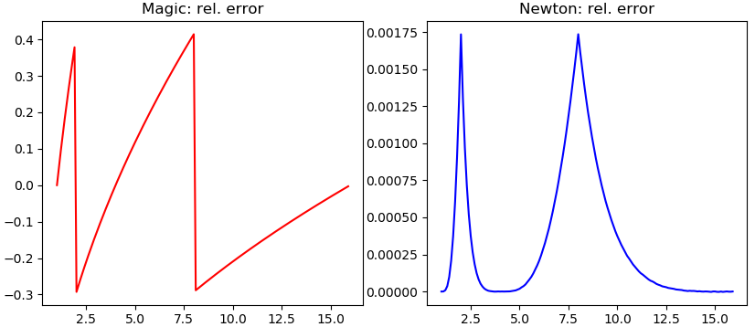

# Fast Inverse Square Root

This repository implements a fast approximation of the inverse square root: 1/√(x).
It is a simplified version of the famous hack used in the 3D game Quake in the 90s.

## Get started

### Code snippet

If you just need the code, simply copy and paste the following code snippet.

````cpp
#include <cstdint>
#include <cstddef>

float fast_inv_sqrt(float x)
{
    float y = x; // y holds the current guess for 1/sqrt(x)
    uint32_t *i = reinterpret_cast<uint32_t *>(&y); // i points to current guess y

    const uint32_t exp_mask = 0x7F800000; // 0xFF<<23
    const uint32_t magic_number = 0x5f000000; // 190<<23

    // initial guess using magic number
    *i = magic_number - ((*i >> 1) & exp_mask);

    // refine guess using small number of Newton iterations
    const size_t num_newton_iter = 2;
    for (size_t i = 0; i < num_newton_iter; ++i)
    {
        y = (x * y * y + 1) / (2 * x * y);
    }

    return y;
}
````

### Analyze algorithm

* Go to `src/`
* Compile the C++ code, e.g. `g++ -O2 fast_inv_sqrt.cpp`, this creates a binary
* Execute the binary, which produces a file "dump.csv"
* Execute the Python script, e.g. `python3 analyze.py`, this shows the plots

## Error

The algorithm performs two steps:
* Apply "bit-magic" to compute an initial guess with at most 41% relative error
* Apply 2 iterations of Newton's method to drive the maximum relative error down to <0.2%

The plot shows the relative error after each of the two steps for x values from 1 to 16.
For more details see [this article](https://githubharald.github.io/fast_inv_sqrt.html).




